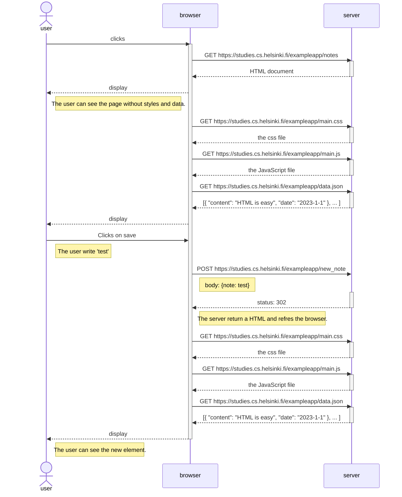

```mermaid
sequenceDiagram
    actor user
    participant browser
    participant server
    
    user->>browser: clicks

    activate browser
    browser->>server: GET https://studies.cs.helsinki.fi/exampleapp/notes
    activate server
    server-->>browser: HTML document
    deactivate server
    browser-->>user: display
    Note left of browser: The user can see the page without styles and data. 

    browser->>server: GET https://studies.cs.helsinki.fi/exampleapp/main.css
    activate server
    server-->>browser: the css file
    deactivate server

    browser->>server: GET https://studies.cs.helsinki.fi/exampleapp/main.js
    activate server
    server-->>browser: the JavaScript file
    deactivate server

    browser->>server: GET https://studies.cs.helsinki.fi/exampleapp/data.json
    activate server
    server-->>browser: [{ "content": "HTML is easy", "date": "2023-1-1" }, ... ]
    deactivate server
    browser-->>user: display

    user->>browser: Clicks on save
    Note right of user: The user write 'test'
    browser->>server: POST https://studies.cs.helsinki.fi/exampleapp/new_note
    Note right of browser: body: {note: test}
    activate server
    server-->>browser: status: 302
    deactivate server
    Note right of browser: The server return a HTML and refres the browser.
   
    browser->>server: GET https://studies.cs.helsinki.fi/exampleapp/main.css
    activate server
    server-->>browser: the css file
    deactivate server

    browser->>server: GET https://studies.cs.helsinki.fi/exampleapp/main.js
    activate server
    server-->>browser: the JavaScript file
    deactivate server

    browser->>server: GET https://studies.cs.helsinki.fi/exampleapp/data.json
    activate server
    server-->>browser: [{ "content": "HTML is easy", "date": "2023-1-1" }, ... ]
    deactivate server

    browser-->>user: display
    deactivate browser

    Note right of user: The user can see the new element. 
```