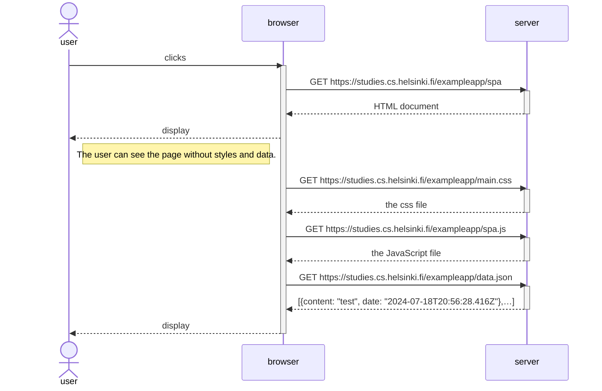

```mermaid
sequenceDiagram
    actor user
    participant browser
    participant server
    
    user->>browser: clicks

    activate browser
    browser->>server: GET https://studies.cs.helsinki.fi/exampleapp/spa
    activate server
    server-->>browser: HTML document
    deactivate server
    browser-->>user: display
    Note left of browser: The user can see the page without styles and data. 

    browser->>server: GET https://studies.cs.helsinki.fi/exampleapp/main.css
    activate server
    server-->>browser: the css file
    deactivate server

    browser->>server: GET https://studies.cs.helsinki.fi/exampleapp/spa.js
    activate server
    server-->>browser: the JavaScript file
    deactivate server

    browser->>server: GET https://studies.cs.helsinki.fi/exampleapp/data.json
    activate server
    server-->>browser: [{content: "test", date: "2024-07-18T20:56:28.416Z"},…]
    deactivate server
    browser-->>user: display

    deactivate browser
```